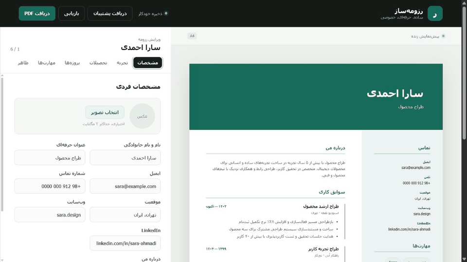
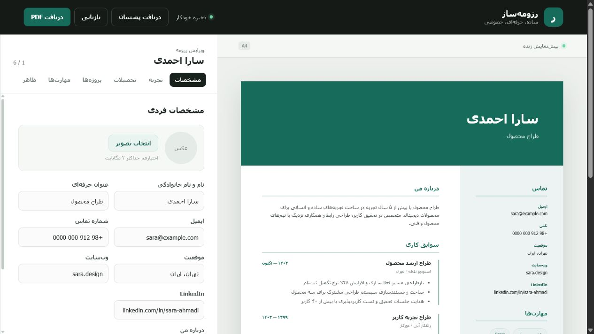
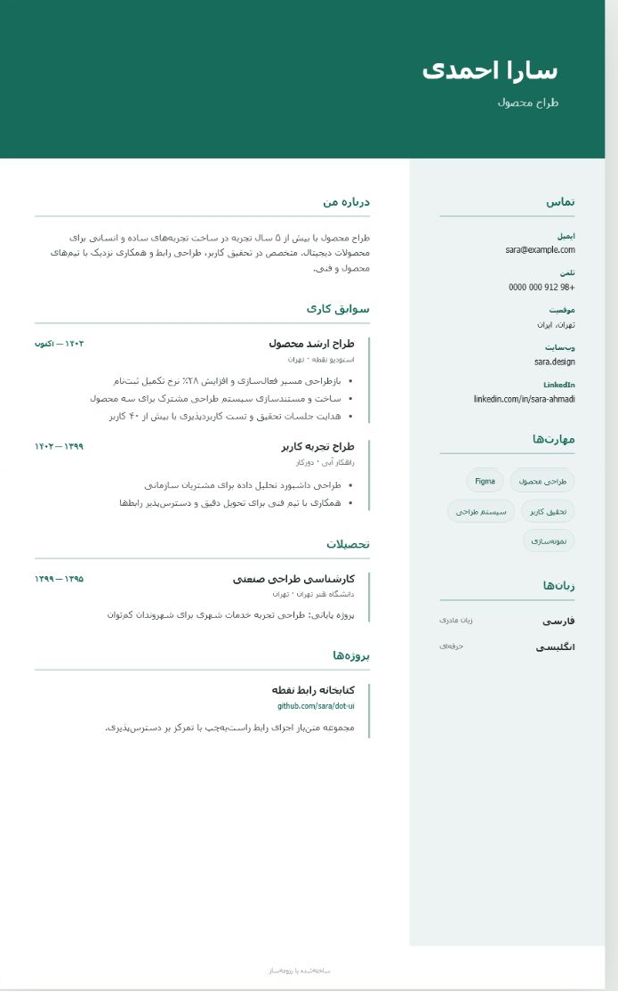
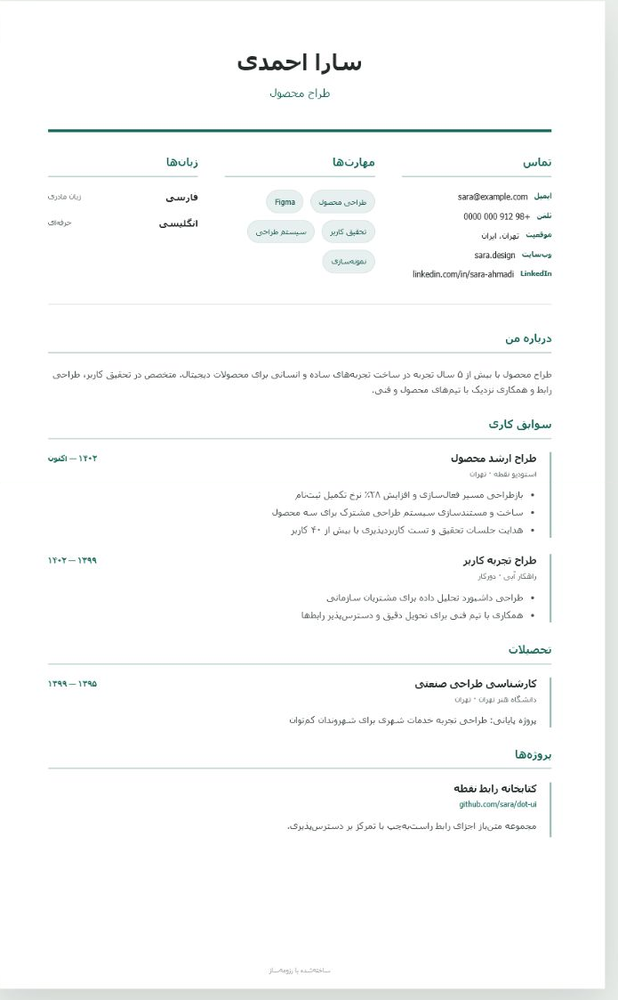

# رزومه‌ساز | Resume Maker

رزومه‌ساز یک ابزار رایگان، دوزبانه و حریم‌خصوصی‌محور برای ساخت رزومه حرفه‌ای در مرورگر است. اطلاعات کاربران از دستگاه خارج نمی‌شود و نتیجه با یک کلیک به PDF استاندارد A4 تبدیل می‌شود.

**[مشاهده نسخه زنده](https://resume-maker-esmaeel.esmailnejad1974.chatgpt.site)**



## تصاویر محیط

### محیط ویرایش



### قالب Modern



### قالب Classic



## قابلیت‌ها

- ویرایش زنده مشخصات، سوابق کاری، تحصیلات، پروژه‌ها، مهارت‌ها و زبان‌ها
- قالب‌های Modern و Classic با رنگ، فونت و فاصله‌گذاری قابل تنظیم
- عنوان‌های واقعی فارسی و انگلیسی برای تمام بخش‌های رزومه
- پشتیبانی کامل از چیدمان راست‌به‌چپ و چپ‌به‌راست
- افزودن عکس پروفایل با کنترل نوع و حجم فایل
- ذخیره خودکار روی دستگاه بدون حساب کاربری یا سرور
- دریافت و بازیابی نسخه پشتیبان JSON
- خروجی PDF استاندارد A4 از طریق چاپ مرورگر
- طراحی واکنش‌گرا، قابل چاپ و دسترس‌پذیر

## اجرای محلی

به Node.js 22.13 یا جدیدتر نیاز است.

```bash
npm ci
npm run dev
```

سپس آدرس نمایش‌داده‌شده در ترمینال را باز کنید.

## بررسی نسخه تولید

```bash
npm test
npm run lint
```

## حریم خصوصی

اطلاعات رزومه فقط در `localStorage` مرورگر ذخیره می‌شود. پاک‌کردن داده‌های مرورگر، اطلاعات ذخیره‌شده را حذف می‌کند؛ برای نگهداری بلندمدت از گزینه «دریافت پشتیبان» استفاده کنید.

## فناوری‌ها

Next.js، React، TypeScript، Vinext و Cloudflare Workers؛ بدون دیتابیس و وابستگی‌های رابط کاربری اضافی.
